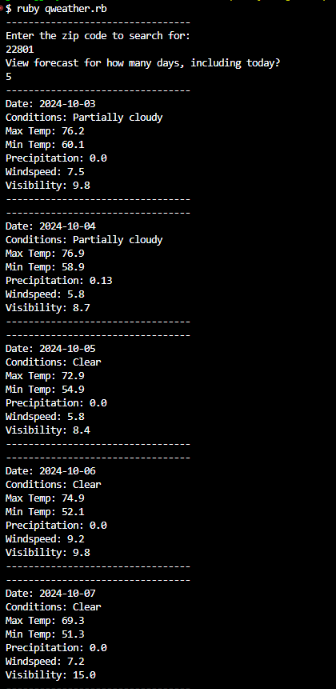

# Qweather

Qweather is a Ruby application for obtaining daily weather information, using data from Visual Crossing.

## Installation

Ensure you have [Ruby](https://www.ruby-lang.org/en/documentation/installation/) installed on your computer:

```bash
ruby --version
```

## Usage

```bash
ruby qweather.rb
```


Enter the zip code you want to search for, followed by the number of days to report.

## License

[MIT](https://choosealicense.com/licenses/mit/)